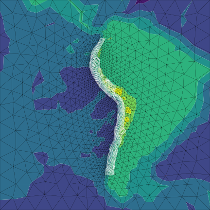
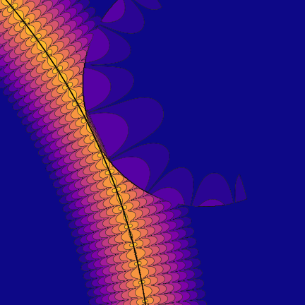

# Integral equation tutorials

## This book is focused on practical software for solving BIEs

Boundary integral equation (BIE) methods are powerful tools for solving PDEs. BIE methods are particular useful in settings where the object of interest is itself a boundary, for example an earthquake fault surface.

BIEs are used across physics and engineering, but most of the examples and problems considered here will come from earthquake science because that is the application that I'm most familiar with. Furthermore, software is a major limitation on earthquake science, so I hope to help remedy that situation. Here are some example problem from earthquake science that we will consider:

* [the displacement caused by slip on a fault beneath topography.](./tdes/sa_tdes)
* and that problem's inverse: given surface displacements, solve for the most likely fault slip field.
* [motion due to to slip on a fault in a viscoelastic medium.](./c1qbx/part5_viscoelastic.ipynb)
* [frictional earthquake cycles on simplified 2D model of an infinitely-long strike slip fault](./c1qbx/part6_qd.ipynb)
amongst many other problems.

Historically, BIEs have been limited to solving problems with simple linear physics. As a result, they have typically been used for solving problems where the interesting aspects lay in the geometry rather than the physics. However, over the last few decades, the key parts of a general-purpose boundary integral equation solver have come together. These components will allow a integral equation method [^ies] to have similar levels of generality to something like a finite difference or finite element method.

[^ies]: The distinction between an "integral equation" and a "*boundary* integral equation" method is important. In an "integral equation" method, there may be volumetric integrals. These integrals are computationally more expensive given that they are one dimension larger than a boundary integral. Volumetric integrals are 3D vs 2D boundary integrals in normal settings or 2D vs 1D in simplified problems.

* Quadrature by expansion {cite:p}`klocknerQuadratureExpansionNew2013` provides a robust approach for numerically calculating singular integrals.
* The fast multipole method {cite:p}`greengardFastAlgorithmParticle1987, yingKernelindependentAdaptiveFast2004` provides a efficient technique for calculating superficially dense matrix-vector products.
* Direct hierarchical inverse methods {cite:p}`bebendorfHierarchicalLUDecompositionbased2005, HodlrLib, greengardFastDirectSolvers2009a, coulierInverseFastMultipole2016` allow for $O(n)$ inversion of the superficially dense BIE matrices.
* Embedded boundary methods {cite:p}`ethridgeNewFastMultipoleAccelerated2001, birosFastSolverStokes2004` allow for handling body forces and nonlinearities. Smooth function extension methods {cite:p}`fryklundPartitionUnityExtension2018` make this approach accurate.

However, these methods have not become mainstream yet. Recent papers have combined most of these methods {cite:p}`askhamAdaptiveFastMultipole2017` but none of these papers have provided source code much less a detailed explanation of how to build a practical implementation.

This "book" will walk through implementing each of these methods in practical applications. Most of the applications will be to earthquake science problems, however there will be other examples where it makes more sense.

At the moment, there are four parts:

1. The introduction: This part will examine the design constraints on a practical integral equation solver. When should we be using integral equation methods? What capabilities do we want from our software? How can we test this software? This is the bird's eye view of the project. It's me being a software architect and asking what our goals (and non-goals!) are here. We'll also consider comparisons with other methods and what problems those methods have and what lessons can be learned from that.
2. The TDE sequence: Triangular dislocation elements (TDEs) are analytic solutions for the displacement and stress from a triangular fault/crack with a constant displacement discontinuity. While they have major limitations, TDEs are nonetheless frequently used for handling earthquake science modeling problems. I hope this track will help enable TDE users to take their applications to a new level by introducing the capability to handle topography, earth curvature and millions of TDEs.
    * In sections 1 and 2, I start by demonstrating how to use TDEs to model arbitrary fault surfaces and Earth surface topography.
    * Then, in sections 3, 4 and 5, I explain how to combine modern fast methods like H-matrices and adaptive cross approximation with TDEs.
3. The QBX sequence: Quadrature by expansion is an elegant approach for numerically integrating the singular integrals in boundary integral equations. Combined with a $C^1$ mesh discretization, fast methods and embedded boundary methods, we can build a fast, robust and general PDE solver. Based on these ideas, I will sketch out what I think the next generation of boundary integral equation methods will look like.
    * In sections 1 and 2, I will explain how to use QBX to evaluate nearfield integrals and then demonstrate QBX on a variety of interesting geometries.
    * In section 3, I will extend QBX from nearfield integrals to directly evaluating singular boundary integral equations, which will allow us to reproduce classical solutions for the displacement resulting from a fault in an elastic half space. That will allow us to solve a BEM problem.
    * In section 4, I will play with topography by extending the code from section 3 to calculate the displacement due to a fault below a mountain.
    * In section 5, I will solve a simple time-dependent viscoelastic earthquake problem.
    * In section 6, I will demonstrate how to simulate earthquake cycles by solving the SCEC SEAS BP1-QD benchmark problem. Both sections 7 and 8 have code that is largely copy pasted from section 6. So section 6 is one of the more important sections.
    * In section 7, I will demonstrate earthquake cycle simulation on two interacting faults.
    * In section 8, I will demonstrate earthquake cycle simulation for a thrust fault.
4. The volumetric sequence: Volumetric integral equations extend the potential of integral equation well beyond the classically narrow domain of boundary integral equations. Most nonlinear or inhomogeneous problems can be solved. This section is still mostly under construction, but the plan is to demonstrate how to solve a range of nonlinear problems in earthquake physics with a particular focus on plastic yielding.

## Prerequisites

The tutorials here are directed at a fairly experienced audience. Some prior knowledge and skills will be necessary:

* **Python skills**: particularly standard scientific Python tools like `numpy` and `matplotlib`. A lot of the code here is vectorized because it allows me to communicate the ideas more concisely while also having reasonably fast code. If you feel that your Python or numpy skills are weak, the tutorials here could be a decent way to learn if you are willing to invest some time into understand. You might consider downloading the notebooks and running them yourself to explore.
* **Applied math skills**: multi-variable calculus, basic partial differential equations, numerical linear algebra. Do you know what it means to "Use an LU decomposition to solve the linear system resulting from a finite difference discretization of the Poisson equation?" I'll try to provide references when I'm discussing more technical topics, but I won't be providing an introduction to basic linear algebra.

It will also be helpful but not necessary to have some familiarity with earthquake and crustal deformation modeling because many of the examples are drawn from that field. Earthquake and Volcano deformation by Segall {cite:p}`segallEarthquakeVolcanoDeformation2010` is a good introduction and reference. I think a powerful method to learn about the computational methods in this field is to read through Segall's book and ask yourself at each step "Okay, this problem is sufficiently simplified that analytical methods are feasible and probably best. But if I wanted to solve this same problem computationally, how would I do that? And what advantages and disadvantages would the computational solution have?"

## Notes

If a section's title is prefixed with "[DRAFT]", then it's less finished, possibly consisting only of a bunch of uncommented unexplained but probably correct code. I've put these sections up because I think they're probably useful to someone even in their unfinished form. In general, I won't put up draft sections unless I think the code is correct. The draftyness refers just to the state of the writing. Also, all of the tutorials are, in some sense, draft form. I expect that corrections and better or expanded explanations will be very common.
